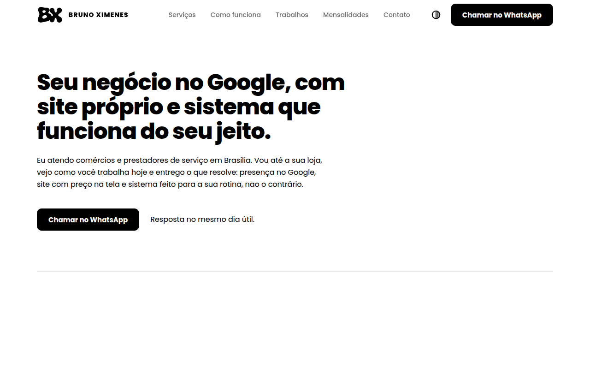
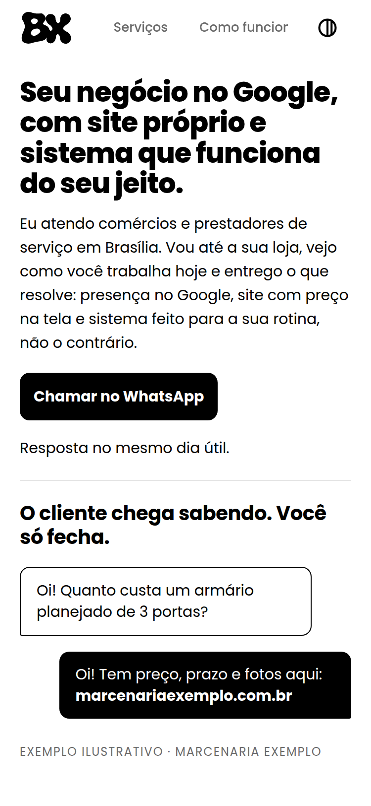

# Bruno Ximenes · Site de apresentação

Site de página única para quem tem comércio ou presta serviço em Brasília:
presença no Google, site com preço na tela e sistema sob medida — com um
botão de WhatsApp que já leva o que a pessoa escolheu.

Site publicado: _em breve_

<p>
  
  
</p>

## O problema

O dono de loja recebe "quanto custa?" no WhatsApp o dia inteiro e responde um
por um. O que ele tem na internet é uma foto solta do cardápio ou do serviço,
um perfil no Google pela metade e nenhum lugar para onde mandar o cliente. Quem
vende esse tipo de solução costuma mandar um PDF ou um portfólio genérico — e a
conversa começa do zero de novo.

## A solução

Uma página única, mobile-first, feita para ser enviada como link no WhatsApp.
Ela mostra o antes e o depois (a conversa que o cliente passa a ter, a busca no
Google que passa a existir), os três serviços com preço e prazo, como o
trabalho acontece em três etapas, um trabalho publicado e as mensalidades. Os
botões "Quero…" montam uma comanda: o botão fixo de WhatsApp passa a mostrar o
total e a mensagem já vai com a lista — a pessoa chama para fechar, não para
perguntar.

## Decisões técnicas

| Decisão | Alternativa descartada | Motivo |
| --- | --- | --- |
| HTML/CSS/JS puro | Framework (React, Vue…) | Site de conteúdo, sem estado além da comanda; zero build, zero dependência para manter. |
| Cloudflare Workers (Static Assets) | Netlify / GitHub Pages | Padrão dos meus projetos: deploy por um comando, sem servidor, CDN com presença no Brasil e plano gratuito. |
| Poppins vendorizada (subset pt-BR, 5 pesos, ~6 KB cada) | Google Fonts | Nenhuma requisição a terceiros, nenhuma troca de fonte à vista na primeira tela e `preload` dos pesos usados na primeira dobra. Licença OFL junto dos arquivos. |
| Tema claro/escuro monocromático | Só tema claro | Segue o sistema, a escolha fica salva e a troca é uma View Transition circular a partir do botão. Como o site é só preto e branco, o tema escuro é o inverso exato. |
| GSAP + ScrollTrigger + Lenis locais | CSS puro / CDN | Intro da marca (o monograma se desenha como traço de marcador, ganha tinta e voa até o cabeçalho) e animações de rolagem com controle fino; arquivos servidos do próprio site. Com `prefers-reduced-motion` tudo nasce no estado final. |
| Contato e mensagens em `public/js/config.js` | Número e textos espalhados no HTML | Trocar número, e-mail ou a mensagem de cada botão sem tocar na apresentação. |
| Escala e respiro menores no celular, via tokens | Mesmos tamanhos do desktop | Só os tokens mudam abaixo de 768px: −23% de rolagem numa tela de 375px mantendo a hierarquia e os alvos de toque de 48px. |

## Acessibilidade e desempenho

- Contraste mínimo de 5,3:1 (tema claro) e 6,9:1 (escuro) em todo texto, inclusive o cinza de apoio.
- Alvos de toque de 48px; `:hover` só com ponteiro que paira (no toque o estado não fica preso).
- `prefers-reduced-motion`: sem intro, sem animação de rolagem, tudo no estado final.
- Reveals só por opacidade: nada sai da ordem do Tab, e o foco faz o bloco aparecer na hora.
- Lighthouse (celular, 18/09/2026): desempenho 100, acessibilidade 100, boas práticas 100, SEO 100.

## Como rodar localmente

```sh
npm install
npx wrangler dev        # http://localhost:8787
```

Número, e-mail e as mensagens do WhatsApp ficam em `public/js/config.js`.

## Como publicar

```sh
npx wrangler login      # uma vez, abre o navegador
npx wrangler deploy     # publica em <nome>.<conta>.workers.dev
```

`canonical`, `og:url`, `og:image` e `sitemap.xml` apontam para a URL pública:
se entrar um domínio próprio, trocar nesses quatro lugares.

## Estrutura de arquivos

```
public/
  index.html               # página única
  css/site.css             # estilo, tokens (cor, escala, espaço) e temas
  js/config.js             # contato e mensagens do WhatsApp (é aqui que se edita)
  js/site.js               # comanda, tema, cabeçalho e animações de rolagem
  js/intro.js              # intro da marca (uma vez por sessão)
  js/vendor/               # gsap, ScrollTrigger e lenis, servidos daqui
  fonts/                   # Poppins subset pt-BR (woff2) + OFL.txt
  assets/logo/             # monograma, lockups, favicon SVG e ícones
  assets/og.png            # imagem de compartilhamento (1200×630)
  favicon.ico, apple-touch-icon.png, site.webmanifest
  robots.txt, sitemap.xml
docs/screenshots/          # capturas usadas neste README
wrangler.jsonc             # deploy (Workers Static Assets)
```

## Direitos

© 2026 Bruno Ximenes. Todos os direitos reservados: o código, a marca BX, os
textos e as imagens deste site não podem ser reutilizados sem autorização.
A Poppins é distribuída sob a SIL Open Font License 1.1 (`public/fonts/OFL.txt`);
GSAP e Lenis seguem as licenças dos seus autores.
